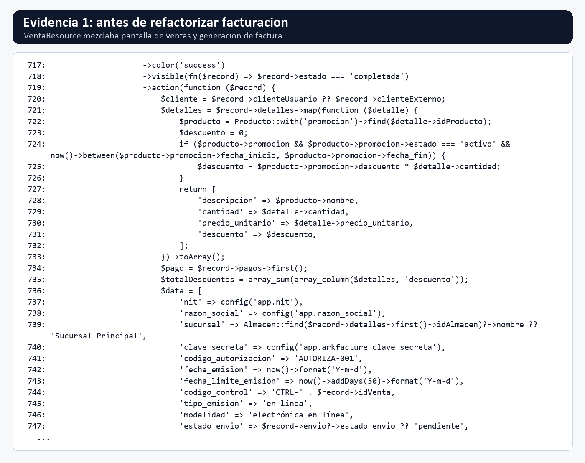
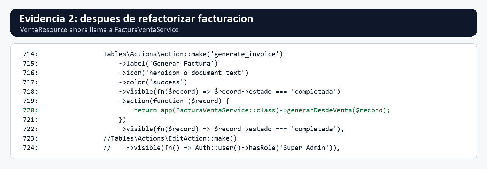
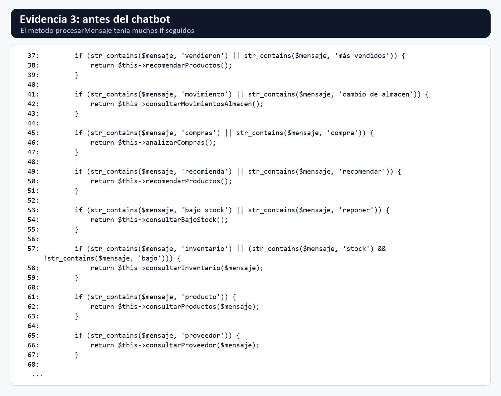
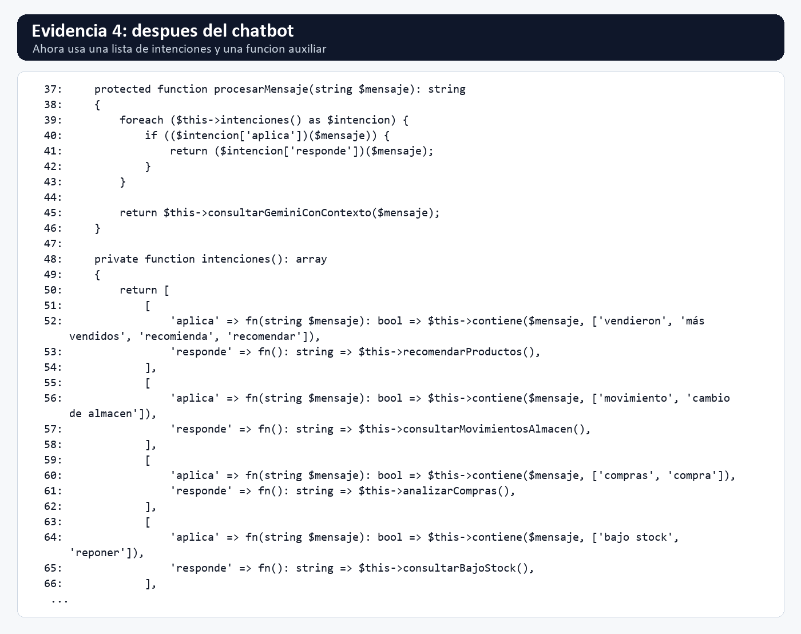
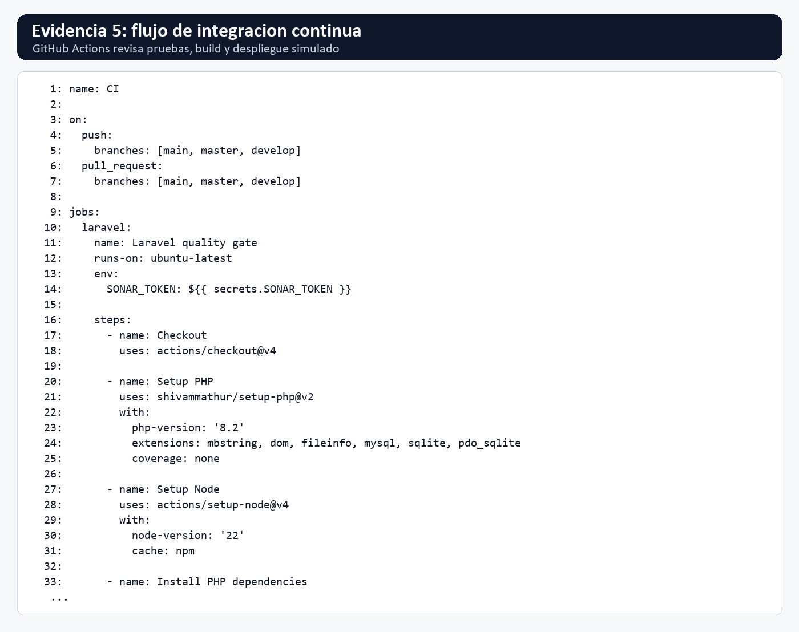
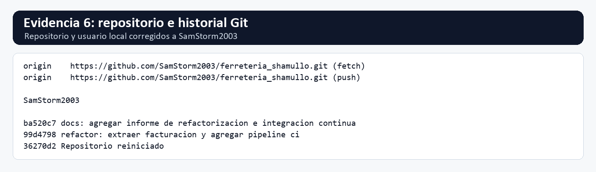

# Sprint de Refactorización e Integración Continua del Sistema

**Proyecto:** Sistema de información Ferretería Shamullo  
**Repositorio:** <https://github.com/SamStorm2003/ferreteria_shamullo.git>  
**Usuario GitHub:** SamStorm2003  
**Fecha:** 13 de julio de 2026

## Introducción

Este informe presenta la revisión y mejora del sistema de información de la Ferretería Shamullo. El sistema fue creado para apoyar el trabajo diario de una ferretería, especialmente en áreas como productos, inventario, compras, ventas, clientes, proveedores, promociones, facturas, reembolsos y reportes.

La revisión se hizo sobre el proyecto real. No se buscó cambiar lo que el usuario ve en pantalla, sino ordenar mejor algunas partes internas para que el sistema sea más fácil de entender, corregir y mejorar en el futuro.

También se preparó un flujo básico de Integración Continua. En palabras simples, esto permite que el proyecto se revise automáticamente cuando se suben cambios al repositorio. Así se pueden detectar errores antes de que afecten la versión principal.

## Parte 1. Diagnóstico del código

Se revisaron archivos relacionados con ventas, facturación, chatbot, pruebas y configuración del repositorio. En la revisión se encontraron varias oportunidades de mejora.

| Problema | Ubicación | Riesgo | Mejora propuesta |
|---|---|---|---|
| Un archivo de ventas tenía demasiadas tareas juntas: pantalla de ventas, reglas de venta y generación de factura. | `app/Filament/Vendedor/Resources/VentaResource.php` | Si se cambiaba algo de facturación, también podía romperse la pantalla de ventas. | Separar la generación de facturas en un archivo propio. |
| El chatbot tenía muchos `if` seguidos para reconocer preguntas del usuario. | `app/Http/Controllers/Api/ChatController.php` | Cada nueva pregunta hacía crecer más el método y volvía el código más difícil de seguir. | Ordenar las preguntas en una lista de intenciones. |
| Había un número fijo escrito directamente en el código para el límite diario de consultas a Gemini. | `ChatController.php` | El número no explicaba por sí solo qué significaba. | Cambiarlo por un nombre claro: `LIMITE_DIARIO_GEMINI`. |
| Existían variables calculadas que luego no se usaban. | `ChatController.php` | Confundían al leer el código porque parecían importantes, pero no afectaban el resultado. | Eliminar esas variables. |
| Algunos textos tenían problemas de acentos o caracteres extraños. | Varios archivos del sistema | Puede verse mal en pantalla y dificulta buscar textos. | Hacer una limpieza posterior de textos y codificación. |
| No había un flujo automático para revisar pruebas, sintaxis y compilación. | No existía `.github/workflows/ci.yml` | Los errores podían descubrirse tarde, después de subir cambios. | Crear un flujo con GitHub Actions. |

## Parte 2. Refactorización aplicada

Refactorizar significa mejorar el orden interno del código sin cambiar lo que el sistema hace para el usuario. En este proyecto se aplicaron mejoras concretas y pequeñas, pero importantes.

### 1. Separar la facturación en una clase propia

**Técnica aplicada:** Extract Class  
**Archivo antes:** `VentaResource.php`  
**Archivo nuevo:** `app/Services/Facturacion/FacturaVentaService.php`

Antes, el archivo de ventas también preparaba y enviaba los datos de la factura. Eso mezclaba dos tareas distintas: mostrar la venta y generar la factura.

**Antes:**

```php
->action(function ($record) {
    $cliente = $record->clienteUsuario ?? $record->clienteExterno;
    $detalles = $record->detalles->map(function ($detalle) {
        $producto = Producto::with('promocion')->find($detalle->idProducto);
        ...
    })->toArray();

    $response = Http::post(config('app.arkfacture_api_url'), $data);
    ...
})
```

**Después:**

```php
->action(function ($record) {
    return app(FacturaVentaService::class)->generarDesdeVenta($record);
})
```

Ahora el archivo de ventas solo llama al servicio de facturación. La preparación de la factura quedó en un lugar más adecuado.

**Principio mejorado:** SOLID y Clean Code. Dicho de forma sencilla, cada parte queda encargada de una tarea más clara.

**Capturas de evidencia:**





### 2. Ordenar la forma en que responde el chatbot

**Técnica aplicada:** Extract Method y Remove Duplicate Code  
**Archivo:** `ChatController.php`

Antes, el chatbot revisaba el mensaje con muchas condiciones seguidas. Funcionaba, pero era incómodo de mantener.

**Antes:**

```php
if (str_contains($mensaje, 'compras') || str_contains($mensaje, 'compra')) {
    return $this->analizarCompras();
}

if (str_contains($mensaje, 'producto')) {
    return $this->consultarProductos($mensaje);
}
```

**Después:**

```php
foreach ($this->intenciones() as $intencion) {
    if (($intencion['aplica'])($mensaje)) {
        return ($intencion['responde'])($mensaje);
    }
}
```

También se agregó un método para buscar palabras clave:

```php
private function contiene(string $mensaje, array $palabrasClave): bool
{
    foreach ($palabrasClave as $palabraClave) {
        if (str_contains($mensaje, $palabraClave)) {
            return true;
        }
    }

    return false;
}
```

Con esto, agregar una nueva respuesta al chatbot es más ordenado.

**Principio mejorado:** DRY y KISS. En palabras simples, se repite menos código y se mantiene más fácil de leer.

**Capturas de evidencia:**





### 3. Cambiar un número fijo por un nombre claro

**Técnica aplicada:** Rename Variable / Replace Magic Number with Constant  
**Archivo:** `ChatController.php`

Antes, el límite diario de consultas estaba como un número directo:

```php
$limiteDiario = 10;
```

Después quedó con un nombre claro:

```php
private const LIMITE_DIARIO_GEMINI = 10;
```

Y se usa así:

```php
if ($consultasRealizadas >= self::LIMITE_DIARIO_GEMINI) {
    ...
}
```

Esto ayuda porque el código ya no muestra solo un número suelto. Ahora se entiende que ese `10` representa el límite diario de consultas a Gemini.

**Principio mejorado:** Clean Code. Los nombres ayudan a entender mejor el propósito de cada dato.

### 4. Eliminar código que no aportaba

**Técnica aplicada:** Remove Dead Code  
**Archivo:** `ChatController.php`

Se quitaron variables que se calculaban, pero no se usaban después.

**Antes:**

```php
$dias_periodo = 90;
$semanas_periodo = $dias_periodo / 7;
$unidades_semanales = ...
```

**Después:** esas líneas fueron eliminadas.

Esto deja el método más limpio y evita confusiones al momento de revisar el sistema.

**Principio mejorado:** KISS y Clean Code.

## Parte 3. Integración Continua

Para el proyecto se diseñó e implementó un flujo básico de Integración Continua usando GitHub Actions.

**Archivo creado:**

```text
.github/workflows/ci.yml
```

### Repositorio Git

El repositorio correcto del proyecto es:

```text
https://github.com/SamStorm2003/ferreteria_shamullo.git
```

El remoto local `origin` quedó apuntando a ese repositorio:

```text
origin  https://github.com/SamStorm2003/ferreteria_shamullo.git
```

También se corrigió el nombre local de Git para los siguientes commits:

```text
SamStorm2003
```

### Estrategia de trabajo

Se recomienda usar **GitHub Flow**, porque es una forma sencilla de trabajar:

1. Crear una rama para un cambio.
2. Hacer los ajustes necesarios.
3. Crear un commit con un mensaje claro.
4. Subir los cambios a GitHub.
5. Revisar que el flujo automático pase correctamente.
6. Unir el cambio a la rama principal.

### Flujo automático propuesto

| Etapa | Qué hace |
|---|---|
| Descargar código | Toma el proyecto desde GitHub. |
| Preparar PHP | Prepara el entorno para Laravel. |
| Preparar Node | Prepara el entorno para la parte visual. |
| Instalar dependencias | Instala lo necesario para que el sistema funcione. |
| Revisar sintaxis | Busca errores básicos en archivos PHP. |
| Ejecutar pruebas | Corre las pruebas del sistema. |
| Compilar frontend | Verifica que la parte visual pueda generarse. |
| Revisar calidad | Deja preparado SonarQube si se configura un token. |
| Despliegue simulado | Simula que el sistema pasó una revisión final. |

### Diagrama del flujo

```text
Commit o Push
     |
     v
GitHub Actions
     |
     v
Instalar dependencias
     |
     v
Revisar sintaxis
     |
     v
Ejecutar pruebas
     |
     v
Compilar frontend
     |
     v
Análisis de calidad
     |
     v
Despliegue simulado
```

**Captura de evidencia del pipeline:**



### Evidencia de GitHub

Se realizó un commit descriptivo para la refactorización:

```text
99d4798 refactor: extraer facturacion y agregar pipeline ci
```

También existe un commit para la documentación:

```text
ba520c7 docs: agregar informe de refactorizacion e integracion continua
```

La captura siguiente muestra el repositorio correcto y el historial de commits:



### Evidencia de pruebas

Se ejecutó:

```text
composer test
```

Resultado:

```text
Tests: 6 passed (14 assertions)
```

También se compiló la parte visual con:

```text
npm.cmd run build
```

Resultado: la compilación terminó correctamente.

## Parte 4. Reflexión técnica

### ¿Qué problemas encontró en su código?

Se encontraron archivos con demasiadas tareas juntas, métodos largos, condiciones repetidas, variables sin uso y falta de una revisión automática antes de subir cambios. También se observaron algunos textos con problemas de acentos.

### ¿Qué técnica de refactorización aportó mayor beneficio?

La mejora que más aportó fue separar la facturación en una clase propia. Esto hizo que el archivo de ventas quedara más pequeño y más fácil de entender.

### ¿Qué principio de diseño aplicó?

Se aplicó principalmente la idea de separar responsabilidades. En palabras simples, cada parte del sistema debe encargarse de una tarea clara. También se buscó que el código sea simple, entendible y con menos repetición.

### ¿Cómo contribuiría la Integración Continua al mantenimiento?

La Integración Continua ayuda porque revisa el proyecto automáticamente cada vez que se suben cambios. Si aparece un error, se puede detectar antes de que afecte a la versión principal. Esto es importante porque el sistema tiene varias áreas conectadas: ventas, compras, inventario, facturas, reportes y usuarios.

### ¿Qué norma internacional respalda estas prácticas?

Estas prácticas se relacionan con:

- **ISO/IEC/IEEE 12207:** mantenimiento y evolución del software.
- **ISO/IEC 25010:** calidad del producto y facilidad para mantenerlo.
- **ISO/IEC 5055:** revisión de la calidad interna del código.
- **IEEE 730:** aseguramiento de la calidad del software.
- **IEEE 828:** control de versiones y configuración.

## Conclusión

El trabajo realizado permitió mejorar el proyecto sin cambiar su funcionamiento principal. Se ordenó la facturación, se simplificó el chatbot, se eliminaron partes innecesarias y se preparó un flujo automático para revisar el sistema.

Además, el proyecto quedó vinculado al repositorio correcto:

```text
https://github.com/SamStorm2003/ferreteria_shamullo.git
```

Con estos cambios, el sistema de Ferretería Shamullo queda mejor preparado para seguir creciendo y para recibir futuras mejoras con menos riesgo.
